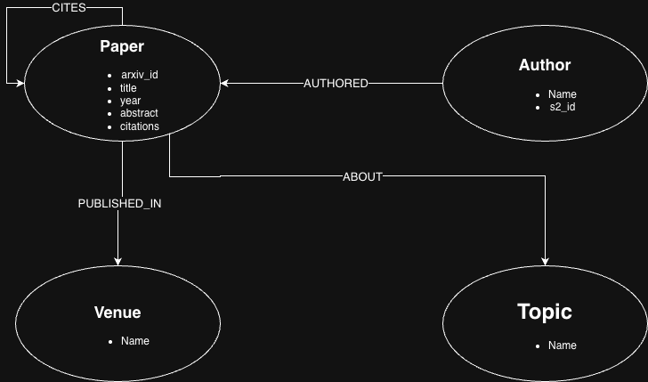

# XAI Knowledge Graph

An end-to-end knowledge graph for Explainable AI research, covering all three KG paradigms — **property graphs**, **semantic web reasoning**, and **embeddings** — with a working **GraphRAG pipeline** benchmarked against vanilla RAG.

Built on real data (3,907 XAI papers from arXiv).

---

## Headline results

| | Metric | Value |
|---|---|---|
| 🧠 **Embeddings** | TransE baseline MRR | **0.220** |
| | TransE baseline Hits@10 | **0.414** |
| | Citation prediction precision@10 (RotatE+NSSALoss, Grad-CAM seed) | **0.90** |
| 🔗 **Semantic reasoning** | SHAP-authors found via OWL property chain | **4,009** (vs 0 without reasoning) |
| 💬 **GraphRAG vs vanilla RAG** | Win rate (10 questions, LLM-as-judge) | **6 / 10** |
| | Completeness gap | **+1.9** (out of 5) |
| | Specificity gap | **+1.5** (out of 5) |
| 📊 **Data scale** | Papers, authors, venues, topics | 3,907 / 13,933 / 733 / 30 |
| | Total edges loaded | 34,451 |

All metrics are reproducible from the notebooks in this repo.

---

## What's inside

```
┌────────────────────────────────────────────────────────────────────┐
│                   XAI Knowledge Graph (3,907 papers)               │
└────────────────────────────────────────────────────────────────────┘
                              │
        ┌─────────────────────┼─────────────────────┐
        │                     │                     │
   1. Property Graph     2. Semantic Web      3. KG Embeddings
      (Neo4j)               (RDF / OWL)         (TransE → RotatE)
        │                     │                     │
        │                     │                     │
        └─────────────────────┼─────────────────────┘
                              │
                       4. GraphRAG Pipeline
                       (NL → Cypher → LLM)
                              │
                              │
                       Benchmark vs Vanilla RAG
```

## Project structure

```
xai-knowledge-graph/
├── docs/              # Schema diagram
├── notebooks/         # 10 reproducible notebooks (data → KG → embeddings → RAG)
├── ontology/          # xai-kg.ttl — custom OWL ontology with FOAF/Dublin Core alignment
├── src/               # graphrag.py — production-ready GraphRAG module with safety layers
├── models/            # Trained PyKEEN checkpoints (TransE × 2, RotatE × 2)
├── requirements.txt
└── README.md
```

### 1. Property graph (Neo4j Aura)
- 4 node types (Paper, Author, Venue, Topic), 4 relationship types
- 11 Cypher queries covering aggregations, multi-hop joins, and per-group ranking
- Schema diagram in 
- Notebook: [`notebooks/neo4j_cypher_queries.ipynb`](notebooks/neo4j_cypher_queries.ipynb)

### 2. Semantic web (RDF + OWL)
- Custom ontology aligned with FOAF (`Author ⊑ foaf:Person`) and Dublin Core
- 87,358 explicit triples → ~174K after OWL-RL reasoning
- 2 reasoning axioms: a property chain (`authored ∘ about → worksOn`) and an inverse property (`cites ↔ isCitedBy`)
- 5 SPARQL queries with results matching their Cypher counterparts
- Notebook: [`notebooks/rdf_sparql_queries.ipynb`](notebooks/rdf_sparql_queries.ipynb)

**Reasoning showcase.** SPARQL query *"Who works on SHAP?"* — without reasoning: **0 authors**. With OWL reasoning: **4,009 authors**. Same query, same data, just the inference layer turned on.

### 3. KG embeddings (PyKEEN) — 2×2 factorial study

Tested all combinations of two models (TransE, RotatE) and two training recipes
(baseline: MarginRankingLoss + 10 negs + 100 epochs; aggressive: NSSALoss + 64 negs + 200 epochs).
Identical split (80/10/10, `random_seed=42`) across all runs.

| Model | Loss | Negatives | Epochs | Hits@10 | MRR |
|---|---|---|---|---|---|
| **TransE** | **MarginRankingLoss** | **10** | **100** | **0.414** | **0.220** |
| TransE | NSSALoss | 64 | 200 | 0.360 | 0.168 |
| RotatE | MarginRankingLoss | 10 | 100 | 0.237 | 0.130 |
| RotatE | NSSALoss | 64 | 200 | 0.364 | 0.197 |

**Key finding: strong model × loss interaction.**

The two architectures have opposite preferences for training recipe:

| | Effect on MRR |
|---|---|
| TransE: baseline → aggressive | **−0.052** (aggressive hurts) |
| RotatE: baseline → aggressive | **+0.067** (aggressive helps) |

**Interpretation.** RotatE represents relations as rotations in complex space, roughly doubling the effective parameter count per relation. With only 10 negatives per positive and 100 epochs of training, the gradient signal isn't dense enough to fit that capacity properly — RotatE collapses to 0.130 MRR, the worst configuration in the study. NSSALoss with 64 negatives provides the richer training signal RotatE needs to be competitive.

TransE's simpler translational geometry doesn't need that signal density. Applying the same aggressive recipe to TransE overfits the smaller parameter space, dropping MRR by 0.052. Architectural complexity and training recipe must match — mismatch hurts in either direction.

**Practical takeaway.** Published recipes for embedding methods are often tied to specific architectures on specific benchmarks; transferring a recipe across architectures (or across KG scales) without revalidation can hurt performance more than the underlying architectural choice itself. The best config on this 34K-triple KG was the simplest one tested (TransE + MarginRankingLoss + 10 negs + 100 epochs).

**Citation link prediction** on arXiv:2105.07190 (XAI taxonomy paper) using the RotatE+NSSALoss checkpoint: 9 of the top-10 predicted citations matched actual citations → **precision@10 = 0.90**. Equivalent experiment on TransE baseline is candidate follow-up work.

**Author similarity** found a known limitation. Querying for authors near S. Lapuschkin in the RotatE+NSSALoss embeddings recovered the Berlin XAI cluster including *both* "W. Samek" and "Wojciech Samek" — the embeddings learned these are the same person despite being stored as separate string-keyed nodes. Useful evidence that learned representations can recover entity identity beyond surface-form dedup.

Notebooks: [`train_transe_basline.ipynb`](notebooks/train_transe_basline.ipynb), [`train_transe_tuned.ipynb`](notebooks/train_transe_tuned.ipynb), [`train_rotate_baseline.ipynb`](notebooks/train_rotate_baseline.ipynb), [`train_rotate_tuned.ipynb`](notebooks/train_rotate_tuned.ipynb), [`link_prediction.ipynb`](notebooks/link_prediction.ipynb)

### 4. GraphRAG vs vanilla RAG
End-to-end natural-language QA pipeline: question → Cypher → graph results → LLM answer. Three-layer safety architecture:
1. System prompt explicitly forbids write keywords.
2. Regex validator inspects generated Cypher before execution.
3. Neo4j session runs in `default_access_mode="READ"` for DB-level enforcement.

Tested against **5 destructive prompts** ("delete all", "drop database", etc.) — all refused.

Compared against a vanilla RAG baseline (sentence-transformer embeddings of abstracts, top-k cosine retrieval, same LLM). 10 questions spanning factual, multi-hop, and conceptual categories were scored by an LLM judge on 4 criteria.

**Example interaction:**

> **Q:** Find papers that cite Grad-CAM and are about Healthcare applications.
>
> **Generated Cypher:**
> ```cypher
> MATCH (p:Paper)-[:CITES]->(t:Paper)
> WHERE t.title CONTAINS "Grad-CAM"
> MATCH (p)-[:ABOUT]->(:Topic {name: "Healthcare"})
> RETURN p.title, p.year, p.citation_count
> ORDER BY p.citation_count DESC LIMIT 5
> ```
>
> **Answer:** Top papers citing Grad-CAM in healthcare: "Explainable AI in deep learning-based medical image analysis" (2021, 1012 citations), "XAI: Opportunities and Challenges Survey" (2020, 749), "Medical Explainable AI via Multi-modal Data Fusion" (2021, 621)...


| Metric | GraphRAG | Vanilla RAG |
|---|---|---|
| Win count | **6** | 4 |
| Accuracy | 3.60 | 4.20 |
| **Completeness** | **4.40** | 2.50 |
| **Specificity** | **4.40** | 2.90 |
| Grounding | 3.40 | 3.40 |

GraphRAG dominates on structural questions (counts, rankings, multi-hop joins). Vanilla RAG dominates on conceptual synthesis questions where the answer requires comparing abstract content. The two approaches are complementary, not competing.

Notebooks: [`graphrag.ipynb`](notebooks/graphrag.ipynb), [`vanilla_rag.ipynb`](notebooks/vanilla_rag.ipynb)

---

## Key finding — LLM-as-judge verification bias

While analyzing the comparison results, I noticed the judge gave GraphRAG `accuracy = 1/5` on questions where it produced **correct, database-verified numerical answers** ("1,057 SHAP papers", "David Martens with 9 Counterfactual papers"), while giving vanilla RAG `accuracy = 5/5` for answering *"it is not possible to determine."*

The judge can only verify claims against the retrieved context. Precise database queries return ground-truth numbers that don't appear verbatim in any abstract, so the judge has no way to validate them and defaults to penalising — while a refusal is trivially "accurate."

**Practical implication**: LLM-as-judge evaluation systematically over-rewards refusals and under-rewards correct-but-unverifiable answers. For production-grade evaluation of factual systems, augment with ground-truth verification or pairwise human review on factual questions.

Documented in [Zheng et al. 2023](https://arxiv.org/abs/2306.05685) as a known judge bias.

---

## Tech stack

| Layer | Tool |
|---|---|
| Property graph | Neo4j Aura Free |
| Semantic web | `rdflib`, `owlrl` |
| Embeddings | PyKEEN (TransE, RotatE) |
| Retrieval embeddings | `sentence-transformers` (`intfloat/multilingual-e5-base`) |
| LLM | Llama 3.3 70B Versatile via Groq |
| Data | arXiv + Semantic Scholar |

---

## Reproduce

Day-by-day, the notebooks are independent and stateful (each persists intermediate artefacts to disk). To reproduce end-to-end:

```bash
git clone https://github.com/Pra0809/xai-knowledge-graph.git
cd xai-knowledge-graph
pip install -r requirements.txt

# Set up credentials (Neo4j Aura free tier + Groq free tier)
cp .env.example ~/.env_xai_kg
# fill in your keys

# Then run notebooks in order:
#data_ingestion → neo4j_cypher_queries → rdf_sparql_queries →
#train_transe_baseline → train_transe_tuned →
#train_rotate_baseline → train_rotate_tuned →
#link_prediction → graphrag → vanilla_rag
```

---

## Scope and honest limitations

- **Data**: 3,907 papers is a meaningful slice of XAI research but not exhaustive. The relevance-sorted pass captured foundational papers like Grad-CAM (26,975 citations); the date-sorted pass captured recency.
- **Author dedup**: relies on Semantic Scholar's `s2_author_id` plus exact name match. Same author with different name forms (e.g., "W. Samek" vs "Wojciech Samek") appears as separate nodes. The RotatE embeddings actually *recover* this in their similarity neighbourhoods — a useful diagnostic but not a fix.
- **Citation graph**: filtered to in-corpus citations only (one paper citing another paper in the dataset). The 26,975 citation count on Grad-CAM is its global citation count from Semantic Scholar, stored as a property.
- **Evaluation**: GraphRAG vs RAG comparison used 10 questions. Win counts (6 vs 4) are indicative, not statistically rigorous. The pattern (GraphRAG wins on structural, RAG on conceptual) is the more reliable signal.
- **LLM-as-judge**: see the verification-bias finding above — judge scores should be interpreted alongside the qualitative answers, not in isolation.

---

## Acknowledgements

Built as a portfolio project alongside the *Foundations of Knowledge Graphs* module at Paderborn University, M.Sc. Computer Science.

Data: [arXiv](https://arxiv.org) (CC BY 4.0 metadata), [Semantic Scholar Academic Graph](https://www.semanticscholar.org/product/api).
